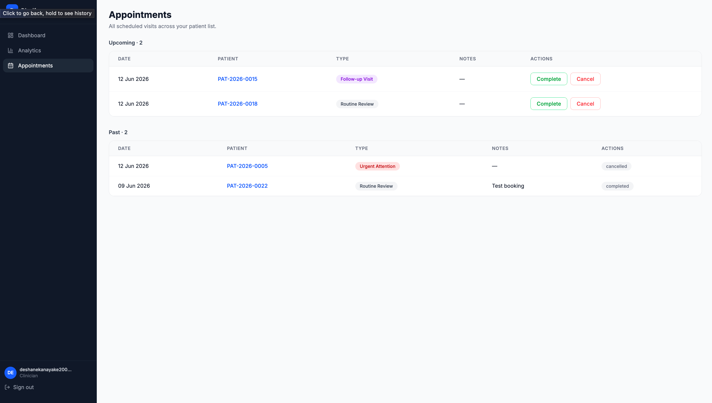
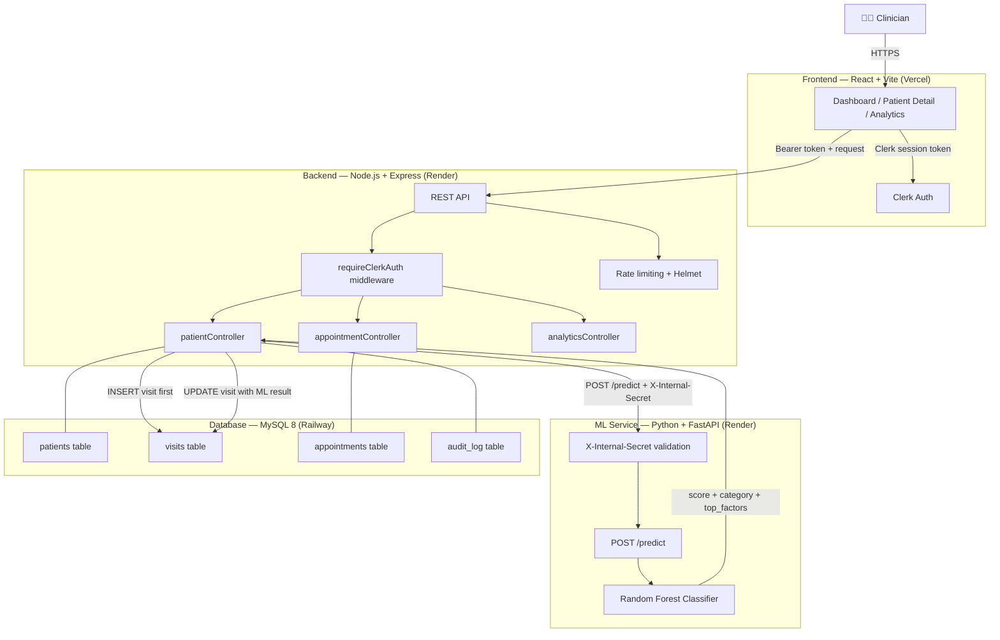

# Diacify

A diabetic patient prioritisation system that answers one question: given the current recorded measurements of each patient in the queue, who needs to be seen first?

Clinicians managing a diabetic cohort face a real problem — a flat list of patients with no indication of urgency. Diacify solves this by scoring each patient's clinical measurements against a trained Random Forest classifier, ranking the list by risk score, and surfacing whether each patient is improving or deteriorating over time.

**Frontend:** React 18 + Vite · Clerk Auth  
**Backend:** Node.js + Express · Zod · helmet · Winston  
**Database:** MySQL 8  
**ML:** Python + FastAPI · scikit-learn · Random Forest  
**DevOps:** Docker · GitHub Actions · Jest · pytest

---

## Screenshots

### Priority Dashboard


### Patient Details


### Analytics


### Appointments


---

## Architecture

Three independent services communicate over HTTP. The ML service is not publicly accessible — it is protected by a shared internal secret header validated on every request.



**Key design decisions:**
- The ML service is decoupled from the patient save — visit data is written to MySQL first, then scored. If the ML service is unavailable, the visit is saved with `risk_category: pending` and no data is lost.
- Authentication is enforced at the backend — the Clerk session token is verified cryptographically on every protected route. `clerk_id` is never trusted from the request body.
- Every patient row is scoped to the authenticated clinician via `clerk_id`, enforced at the query level — not just the UI.

---

## The Machine Learning Component

### Dataset
Trained on the **Erbil Diabetes Dataset** (Mendeley Data, DOI: 10.17632/3snnp89967.1) — 662 patients referred by physicians for diabetes-related testing at a private laboratory in Erbil, Kurdistan Region of Iraq.

Key preprocessing steps:
- BP encoding normalised to real mmHg (dataset mixed two formats across rows)
- BMI outliers capped at 70 (max raw value was 332.2 — data entry errors)
- FBS excluded (96.5% missing — only 23 of 662 records had values)

### Model
Random Forest classifier (scikit-learn). Justified by Alsadi et al. (BMC Medical Informatics, 2024), Ashisha et al. (IJCIS, 2024), and Ooka et al. (BMJ Nutrition, 2021) — all demonstrating Random Forest superiority for diabetes classification over logistic regression and decision trees.

### Classification Labels — ADA 2025 Grounded
Labels are derived from published clinical thresholds, not invented rules.

**Primary driver — HbA1c using ADA 2025 diagnostic categories:**
- Low: HbA1c < 5.7%
- Medium: HbA1c 5.7–6.4% (prediabetes)
- High: HbA1c ≥ 6.5% (diabetes diagnostic threshold)

**Secondary upgrade rule** — if a patient has 2 or more of the following flags raised, their label upgrades one tier (never downgraded):
1. BP ≥ 140/90 mmHg (Diabetes UK)
2. BMI ≥ 30 kg/m² (Diabetes UK)
3. RBS ≥ 126 mg/dL
4. TG/HDL ratio ≥ 2.8 (Baneu et al., Biomedicines, 2024)
5. LDL/HDL ratio ≥ 3.5

### Engineered Features
Four features derived from existing columns:
- **TG/HDL ratio** — surrogate for insulin resistance (Baneu et al., AUC 0.88)
- **LDL/HDL ratio** — dyslipidaemia indicator
- **Hypertension flag** — binary: systolic ≥ 140 OR diastolic ≥ 90
- **Age-BMI interaction** — captures non-linear combined risk

### Risk Score
The 0–100 continuous score is derived from class probabilities:
- Low category → mapped to 0–39
- Medium category → mapped to 40–69
- High category → mapped to 70–100

A `low_confidence` flag is set when max class probability < 0.40, surfaced on the patient detail page.

---

## Before and After — What Changed

This project was originally submitted as a university final year project.The examiner identified six critical issues. Every one has been addressed in this rebuild.

| Issue | Original | Rebuilt |
|---|---|---|
| No backend authentication | `clerk_id` trusted from request body — any user could access any clinician's data | Clerk session token verified cryptographically on every route via `@clerk/express` |
| No unique patient identity | Auto-increment integer only | Human-readable `PAT-YYYY-NNNN` IDs generated at creation |
| No visit history | One record per patient, ever | Append-only `visits` table — full longitudinal history, trends calculated across visits |
| ML labels were synthetic | Self-invented point scoring system | ADA 2025 HbA1c thresholds + five-flag composite upgrade rule, every threshold citable |
| ML service crash = data loss | Patient save failed entirely if FastAPI unavailable | Visit saved first, ML called async, `pending` state if ML unreachable |
| No tests | Zero Jest, zero pytest | 8 Jest integration tests + 4 pytest tests, all passing |
| No CI/CD | No automated pipeline | Three GitHub Actions workflows with path filters, MySQL service container, GHCR push |
| Flat database schema | Single `patients` table | Normalised: `patients`, `visits`, `appointments`, `audit_log` |
| No security headers | No helmet, no rate limiting | helmet.js + express-rate-limit + Winston logging |
| ML service publicly accessible | Open CORS, no authentication | `X-Internal-Secret` header required on every ML request |

---

## CI/CD

Three GitHub Actions workflows with path filters — each only triggers when its own service changes.

| Workflow | Trigger | What it does |
|---|---|---|
| `backend-ci.yml` | `backend/**` changes | Spins up MySQL 8 service container, runs migrations 001–005, runs 8 Jest tests, deploys to Render on merge to main |
| `frontend-ci.yml` | `frontend/**` changes | Runs ESLint, runs Vite build, Vercel redeploys automatically via GitHub integration |
| `ml-ci.yml` | `machine-learning/**` changes | Trains model from dataset, runs 4 pytest tests via FastAPI TestClient, validates Docker build, pushes image to GHCR on merge to main |

---

## Docker

Run the full stack locally with one command:

```bash
# Copy and fill in your secrets
cp .env.example .env

# Start all services
docker compose up --build
```

Services:
- `db` — MySQL 8 on port 3307, auto-runs migrations on first start
- `ml` — FastAPI on port 8001
- `backend` — Express on port 3001, waits for healthy db and ml
- `frontend` — Vite dev server on port 5173

---

## Features

### Dashboard
- Summary cards showing High, Medium, and Low risk patient counts
- Priority patient list sorted by risk score, HbA1c, then patient ID
- Trend arrow per patient — worsening, improving, or stable vs previous visit
- Search by Patient ID and filter by risk level
- This week's appointments widget
- Deterioration alert banner when any patient moves to a higher risk category

### Patient Detail
- Current risk score with semicircular gauge (0–100)
- Confidence breakdown per class (Low / Medium / High %)
- Top contributing factors with relative importance bars
- HbA1c trajectory chart with ADA 2025 reference lines at 5.7% and 6.5%
- Risk score trajectory chart with colour-coded bands
- Metric sparklines: BMI, Systolic BP, RBS, Triglycerides
- Full visit history table with expandable rows
- Appointment booking and history

### Security
- Clerk session token verified on every backend route
- ML service protected by `X-Internal-Secret` shared header
- helmet.js security headers on all responses
- Rate limiting: 100 req/min read, 20 req/min write, 5 req/min auth
- Audit log on all patient data mutations
- Non-root user in ML Docker container

---

## Prerequisites

- Node.js v20+
- Python 3.11+
- MySQL 8.0+
- Docker Desktop (optional — for compose setup)

---

## Local Setup (Manual)

### 1. Clone

```bash
git clone https://github.com/deshanekanayaka/diacify.git
cd diacify
```

### 2. Frontend

```bash
cd frontend
npm install
```

Create `frontend/.env`:
```env
VITE_API_URL=http://localhost:3001
VITE_CLERK_PUBLISHABLE_KEY=pk_test_...
```

### 3. Backend

```bash
cd backend
npm install
```

Create `backend/.env`:
```env
PORT=3001
NODE_ENV=development
DB_HOST=localhost
DB_USER=root
DB_PASSWORD=your_mysql_password
DB_NAME=diacify_db
DB_PORT=3306
ML_SERVICE_URL=http://localhost:8001
CLERK_SECRET_KEY=sk_test_...
ML_INTERNAL_SECRET=your_shared_secret
```

### 4. Database

```bash
mysql -u root -p -e "CREATE DATABASE diacify_db;"
cd backend/database/migrations
for f in 001 002 003 004 005; do
  mysql -u root -p diacify_db < ${f}_*.sql
done
```

### 5. ML Service

```bash
cd machine-learning
python -m venv venv
source venv/bin/activate
pip install -r requirements.txt
python train_model.py
```

Create `machine-learning/.env`:
```env
ML_INTERNAL_SECRET=your_shared_secret
PORT=8001
```

### 6. Run

Open three terminals:

```bash
# Terminal 1 — Backend
cd backend && npm run dev

# Terminal 2 — ML Service
cd machine-learning && source venv/bin/activate && uvicorn app:app --reload --port 8001

# Terminal 3 — Frontend
cd frontend && npm run dev
```

---

## Environment Variables Reference

### Backend
| Variable | Description |
|---|---|
| `PORT` | Server port (default 3001) |
| `DB_HOST` | MySQL host |
| `DB_USER` | MySQL user |
| `DB_PASSWORD` | MySQL password |
| `DB_NAME` | Database name (`diacify_db`) |
| `DB_PORT` | MySQL port (default 3306) |
| `ML_SERVICE_URL` | URL of the FastAPI ML service |
| `CLERK_SECRET_KEY` | Clerk backend secret key |
| `ML_INTERNAL_SECRET` | Shared secret for ML service auth |

### Frontend
| Variable | Description |
|---|---|
| `VITE_API_URL` | Backend API base URL |
| `VITE_CLERK_PUBLISHABLE_KEY` | Clerk publishable key |

### ML Service
| Variable | Description |
|---|---|
| `ML_INTERNAL_SECRET` | Must match backend value exactly |
| `PORT` | ML service port (default 8001) |

---

## API Reference

Base URL: `http://localhost:3001`

All `/api/*` routes require `Authorization: Bearer <clerk_session_token>`.

### Patients
| Method | Endpoint | Description |
|---|---|---|
| GET | `/api/patients` | Priority list, latest visit per patient, sorted by risk score |
| GET | `/api/patients/:id` | Patient detail with full visit history |
| POST | `/api/patients` | Create patient, trigger ML scoring |
| PUT | `/api/patients/:id` | Add new visit (append-only, never overwrites) |
| DELETE | `/api/patients/:id` | Delete patient, write to audit_log |

### Appointments
| Method | Endpoint | Description |
|---|---|---|
| POST | `/api/appointments` | Book appointment |
| GET | `/api/appointments/:patientId` | Get patient appointments |

### Analytics
| Method | Endpoint | Description |
|---|---|---|
| GET | `/api/analytics` | Cohort analytics — risk migration, HbA1c trends, distributions |

### Health
| Method | Endpoint | Description |
|---|---|---|
| GET | `/health` | Returns DB and ML service status |

---

## Literature

| Source | Relevance |
|---|---|
| ADA Standards of Care 2025 | HbA1c thresholds (5.7% / 6.5%) used for classification labels |
| Diabetes UK guidelines | BP threshold (140/90 mmHg), BMI obesity threshold (30 kg/m²) |
| Baneu et al., Biomedicines, 2024 | TG/HDL ratio as insulin resistance surrogate, AUC 0.88 |
| Alsadi et al., BMC Medical Informatics, 2024 | Random Forest superiority for diabetes classification |
| Ashisha et al., IJCIS, 2024 | RF achieves 92–94% accuracy on diabetes datasets |
| Ooka et al., BMJ Nutrition, 2021 | RF outperforms MLR for HbA1c prediction |
| Shahraki et al., JRMS, 2025 | HbA1c + lipid panel as optimal feature combination |
| Erbil Diabetes Dataset, Mendeley, 2024 | Training dataset — DOI: 10.17632/3snnp89967.1 |

---

## What This System Is Not

- It does not diagnose diabetes
- It does not predict who will develop diabetes
- It does not integrate with external EMR systems
- It is not a replacement for clinical judgement — all scores are decision support only

---

## Future Enhancements

- EMR system integration
- Automated follow-up notifications
- Model retraining pipeline on real clinical outcome labels
- Patient outcome tracking
- Export functionality for reports and analytics
- Mobile application