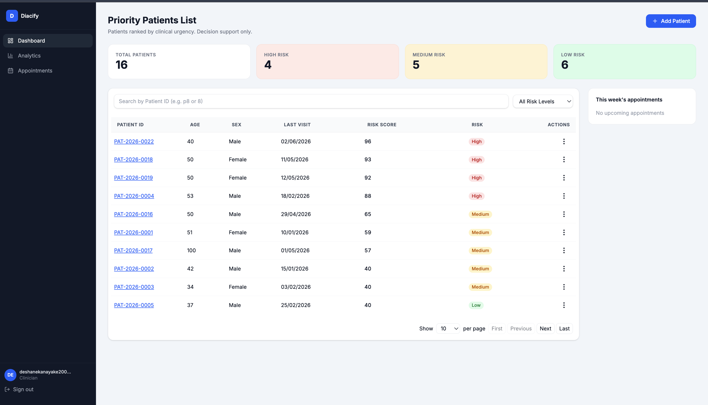
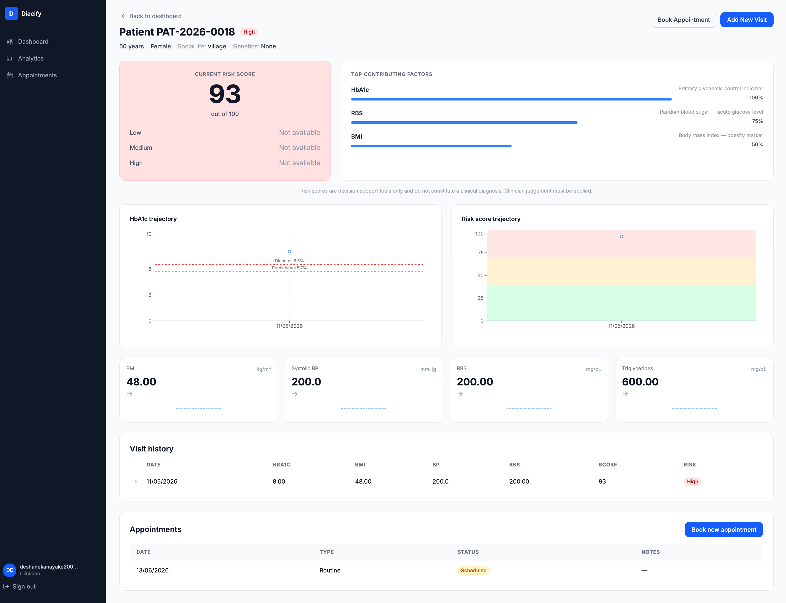
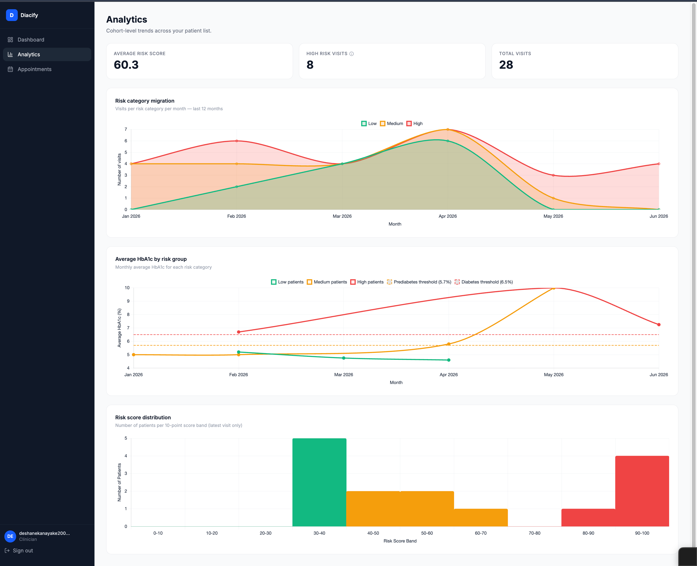
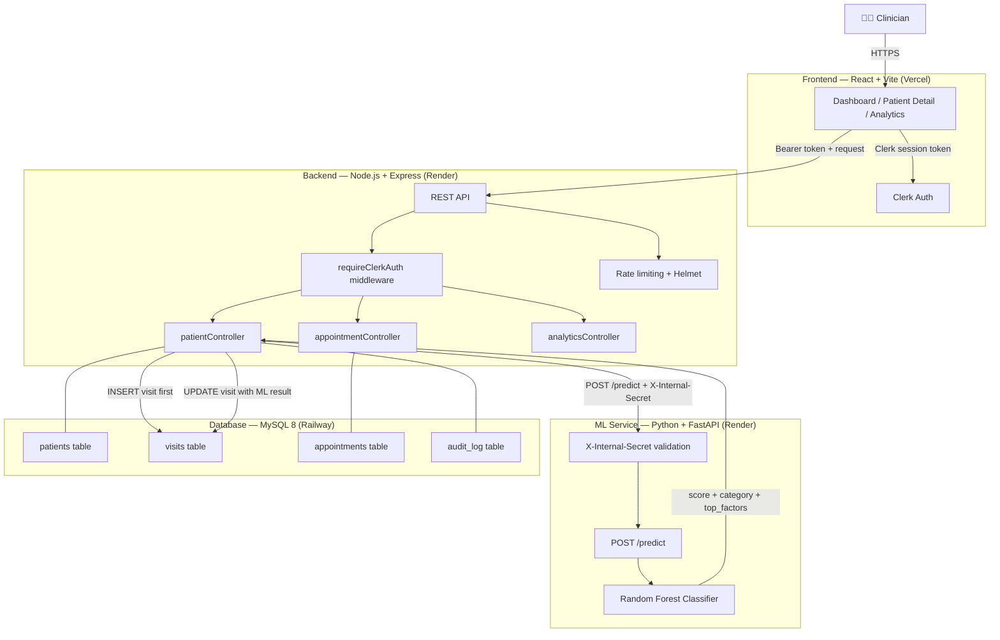

# Diacify

A clinical triage tool that ranks diabetic patients by urgency using an 
ML risk score, longitudinal visit tracking, and appointment management.

Stack: React · Node.js/Express · MySQL · Python/FastAPI · Random Forest · Clerk

---

## Screenshots

### Priority Dashboard


### Patient Detail


### Analytics


### Book Appointment


---

## Architecture



---

## Tech Stack

**Frontend**
- React 18 — component-based UI
- Vite — build tool and development server
- Clerk — authentication and session management
- react-chartjs-2 — trajectory and analytics charts
- axios — HTTP client

**Backend**
- Node.js + Express.js — RESTful API
- MySQL 8 — relational data storage
- Zod — server-side input validation
- Clerk SDK — backend session token verification
- helmet — security headers
- express-rate-limit — rate limiting
- winston — structured logging

**Machine Learning**
- Python + FastAPI — ML microservice
- scikit-learn — Random Forest classifier
- pandas / numpy — data preprocessing

---

## Features

### Dashboard
- Summary cards showing High, Medium, and Low risk patient counts
- Priority patient list sorted by risk score, HbA1c, then patient ID
- Search by Patient ID
- Filter by risk level
- This week's appointments widget

### Patient Detail
- Current risk score with semicircular gauge
- Top contributing factors with relative importance bars
- HbA1c trajectory chart with ADA reference lines at 5.7% and 6.5%
- Risk score trajectory chart with colour-coded bands
- Sparklines for BMI, Systolic BP, RBS, and Triglycerides
- Full visit history table with expandable rows
- Appointment booking and history

### Patient Management
- Add, edit, and delete patient records
- Visit history — one row per clinical visit, full longitudinal record
- Client and server-side validation with clinical range checking
- Risk score and category automatically recalculated on every new visit

### Machine Learning
- Random Forest classifier trained on the Erbil Diabetes Dataset (662 patients)
- Labels derived from ADA 2025 diagnostic thresholds — HbA1c primary driver
- Secondary upgrade rule using five clinical flags (BP, BMI, RBS, TG/HDL ratio, LDL/HDL ratio)
- 14 features including four engineered features: TG/HDL ratio, LDL/HDL ratio, hypertension flag, age-BMI interaction
- Risk scored on a 0–100 continuous scale
- Three risk categories: Low (0–39), Medium (40–69), High (70–100)
- Confidence percentages returned per class
- Low confidence flag when max class probability < 0.40

### Security
- Clerk session token verified on every backend route
- ML service protected by shared internal secret header
- helmet.js security headers
- Rate limiting on all API routes
- Audit log on all patient data actions

---

## Prerequisites

- Git
- Node.js v20 or higher
- npm
- MySQL 8.0 or higher
- Python 3.11 or higher

---

## Setup

### 1. Clone the Repository

```bash
git clone https://github.com/deshanekanayaka/diabetic-risk-classification-system
cd diabetic-risk-classification-system
```

### 2. Frontend Setup

```bash
cd frontend
npm install
```

Create a `.env` file in the `frontend/` directory:

```env
VITE_API_URL=http://localhost:3300
VITE_CLERK_PUBLISHABLE_KEY=your_clerk_publishable_key_here
```

### 3. Backend Setup

```bash
cd backend
npm install
```

Create a `.env` file in the `backend/` directory:

```env
PORT=3300
NODE_ENV=development

DB_HOST=localhost
DB_USER=root
DB_PASSWORD=your_mysql_password
DB_NAME=diacify_db
DB_PORT=3306

ML_SERVICE_URL=http://localhost:8001
CLERK_SECRET_KEY=your_clerk_secret_key_here
ML_INTERNAL_SECRET=your_shared_secret_here
```

### 4. Database Setup

```bash
mysql -u root -p
```

```sql
CREATE DATABASE diacify_db;
exit
```

Run migrations in order:

```bash
cd backend/database/migrations
mysql -u root -p diacify_db < 001_create_patients.sql
mysql -u root -p diacify_db < 002_create_visits.sql
mysql -u root -p diacify_db < 003_create_appointments.sql
mysql -u root -p diacify_db < 004_create_audit_log.sql
mysql -u root -p diacify_db < 005_add_indices.sql
```

### 5. Machine Learning Setup

```bash
cd machine-learning
python -m venv venv
source venv/bin/activate        # Windows: venv\Scripts\activate
pip install -r requirements.txt
python train_model.py
```

Create a `.env` file in the `machine-learning/` directory:

```env
ML_INTERNAL_SECRET=your_shared_secret_here
PORT=8001
```

---

## Running the Project

Open three terminal windows:

**Terminal 1 — Backend**
```bash
cd backend
npm run dev
```
Runs at `http://localhost:3300`

**Terminal 2 — ML Service**
```bash
cd machine-learning
source venv/bin/activate
uvicorn app:app --reload --port 8001
```
Runs at `http://localhost:8001`

**Terminal 3 — Frontend**
```bash
cd frontend
npm run dev
```
Runs at `http://localhost:5173`

---

## API Endpoints

Base URL: `http://localhost:3300`

### Patients
| Method | Endpoint | Description |
|--------|----------|-------------|
| GET | `/api/patients` | Get all patients for the authenticated clinician |
| GET | `/api/patients/:id` | Get patient by ID including all visits |
| POST | `/api/patients` | Add new patient and trigger ML scoring |
| PUT | `/api/patients/:id` | Update patient record |
| DELETE | `/api/patients/:id` | Delete patient |

### Appointments
| Method | Endpoint | Description |
|--------|----------|-------------|
| POST | `/api/appointments` | Book a new appointment |
| GET | `/api/appointments/:patientId` | Get all appointments for a patient |

### Analytics
| Method | Endpoint | Description |
|--------|----------|-------------|
| GET | `/api/analytics` | Get cohort analytics data |

### Health
| Method | Endpoint | Description |
|--------|----------|-------------|
| GET | `/health` | Service health check including DB and ML status |

### ML Service
| Method | Endpoint | Description |
|--------|----------|-------------|
| GET | `/` | ML service health check |
| POST | `/predict` | Score a patient (internal use only) |

---

## Environment Variables Reference

### Backend
| Variable | Description |
|----------|-------------|
| `PORT` | Server port (default 3300) |
| `DB_HOST` | MySQL host |
| `DB_USER` | MySQL user |
| `DB_PASSWORD` | MySQL password |
| `DB_NAME` | Database name (diacify_db) |
| `DB_PORT` | MySQL port (default 3306) |
| `ML_SERVICE_URL` | URL of the ML FastAPI service |
| `CLERK_SECRET_KEY` | Clerk backend secret key |
| `ML_INTERNAL_SECRET` | Shared secret for ML service authentication |

### Frontend
| Variable | Description |
|----------|-------------|
| `VITE_API_URL` | Backend API base URL |
| `VITE_CLERK_PUBLISHABLE_KEY` | Clerk publishable key |

### ML Service
| Variable | Description |
|----------|-------------|
| `ML_INTERNAL_SECRET` | Must match backend value |
| `PORT` | ML service port (default 8001) |

---

## Future Enhancements

- Integration with hospital Electronic Medical Record (EMR) systems
- Mobile application
- Automated notifications for follow-up appointments
- Patient outcome tracking and model retraining on real clinical labels
- Export functionality for reports and analytics
- Google Calendar integration for appointment management